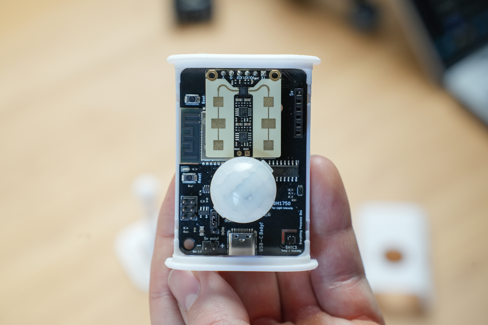

# Everything Presence One

The Everything Presence One is a presence sensor for the smart home. It combines a mmWave sensor, motion sensor, light illuminance sensor, temperature and humidity sensor and integrates directly with [Home Assistant](https://www.home-assistant.io/) through [ESPHome](https://esphome.io/).

The official user guide for the EP1 is located [here](https://everythingsmarthome.github.io/everything-presence-one/)!



## MQTT Edition
This fork includes changes to no longer interface directly with Home Assistant, it switches the communication mode to use MQTT instead.

You will need to set-up a secrets.yaml file for this to work correctly with the following entities:
```
wifi_ssid: "local SSID"
wifi_password: "password"
mqtt_ip: "192.168.86.xxx"
mqtt_username: "username"
mqtt_password: "password" 
```
